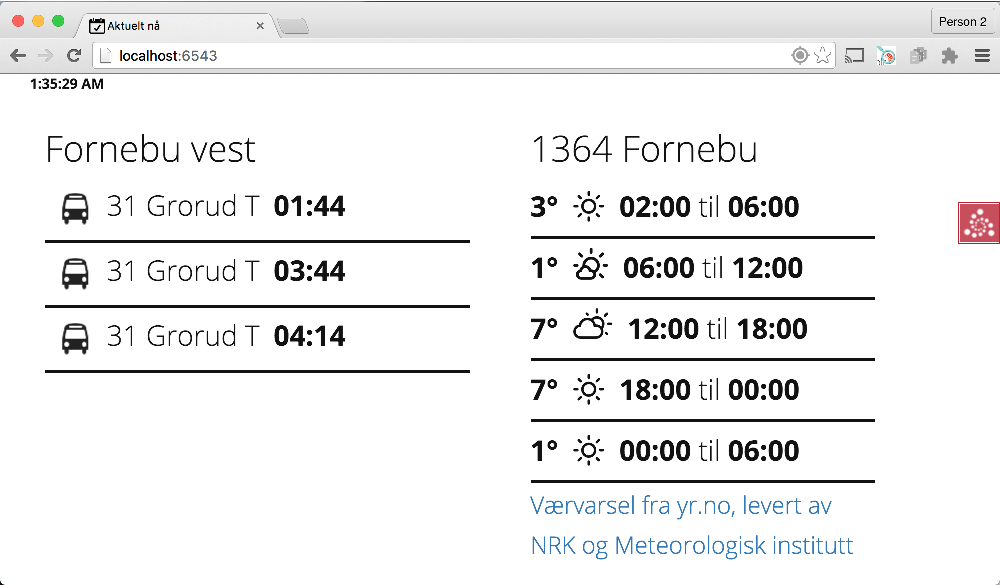

Home Screen
===========
The purpose of home screen is to show the most relevant information for the user. The application is location aware, and will show the most relevant information for the user at any given time.

This domain of contextual information is enormous, so the application is built around a limited set of sources for now.

The information shown is 

* Digital watch
* Weather forecasts from YR
* The next busses for the closes bus stops

This is how it should look like in Development

Author
------
Andreas Dreyer Hysing

All rights reserved

System requirements
-------------------
* OSX OR Ubuntu 14.04
* Python 2.7.3
* pip
* Pyramid framework
* pip
* [Google App Engine SDK for Python](https://cloud.google.com/appengine/downloads#Google_App_Engine_SDK_for_Python)
* [virtualenv](https://virtualenv.pypa.io/en/latest/)

Installation
------------
Software does not run on thin air, and an installation process is necessary to get this webapp up and running. The application runs both on premise and in the cloud. 

This documentation is written for Ubuntu Linux 14.04. Shell commands will only run on Linux with  [Bash](https://en.wikipedia.org/wiki/Bash_%28Unix_shell%29).
The software has been tested on Mac OSX and Ubuntu only.

### Install Prerequesites
Install python with pip and virtualenv. This requires Ubuntu Linux.

  	sudo apt-get install -y python
  	sudo apt-get install -y python-pip
  	sudo pip install virtualenv

Install Google app engine SDK as described in [GAE SDK for Python documentation](https://cloud.google.com/appengine/downloads#Google_App_Engine_SDK_for_Python)

### Get the code from VCS
This step is only required if the code is gotten through VCS. If this is not the case skip straight to the next section.

Install git to get the code.

	sudo apt-get install -y git

Get the code through git and enter the code directory. Type your username and password as set up on your profile on [https://bitbucket.org/](https://bitbucket.org/). Assure you have the right access rights. 

We assume use user `ahysing` and continue as given

  	git clone https://ahysing@bitbucket.org/ahysing/home-screen.git

### Create a virtual environment.

   	virtualenv venv

Activate virtualenv and install required modules.

  	source venv/bin/activate
  	cd homescreen/webapp
  	pip install -r requirements.py -t lib/

### Running

	sudo python setup.py install
	pserve development.ini

The application is now running on [http://localhost:6543](http://localhost:6543) . Stop the application by sending the kill signal in the shell with `Ctrl+C` key comination. 

Further reading
===============

* [Testing](webapp/documentation/TEST.md)
* [Deploy](webapp/documentation/DEPLOY.md)
